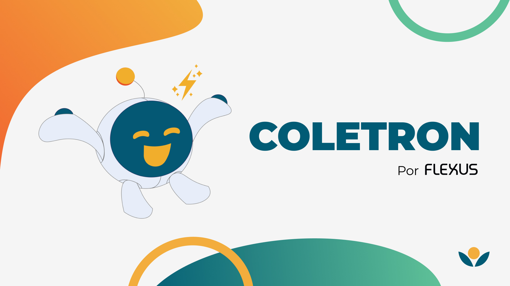
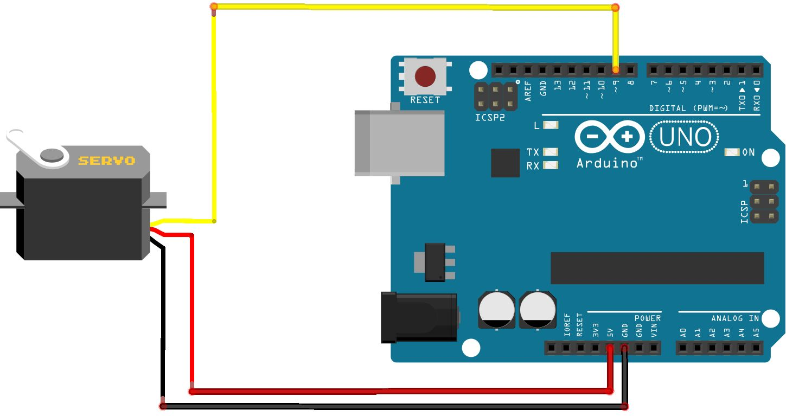
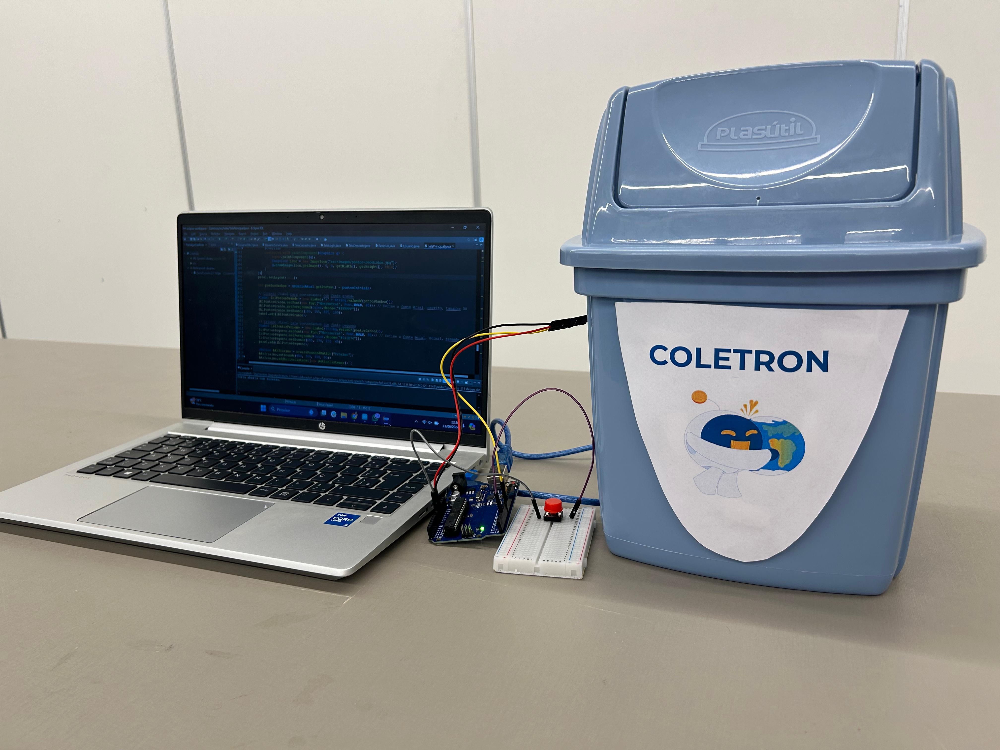

# Coletron



## Descrição do Projeto

A nossa solução, nomeada Coletron, foi pensada para conectar todos os pontos e agentes que fazem parte da logística reversa (LR), como o consumidor final, a população, empresas que coletam materiais, que reciclam e separam para assim chegar ao destino final correto dos materiais, como para empresas maiores que tenham interesse de fazer a logística reversa nesses produtos de origem eletrônica.

O Coletron consiste em uma máquina que possibilita que pessoas interessadas em contribuir para o ciclo de logística reversa possam descartar de forma fácil seus aparelhos eletrônicos e, em troca desse gesto, o usuário consegue acumular pontos que podem ser utilizados para receber benefícios variados, sejam descontos em produtos ou em serviços de lazer e cultura, incentivando não apenas o descarte adequado, mas também o engajamento comunitário.

## Tecnologias Utilizadas

- **Java**: Programação orientada a objetos.
- **Java Swing**: Biblioteca para a construção das interfaces gráficas.
- **JSerialComm**: Biblioteca para integração com o dispositivo Arduino Uno.
- **Arduino Uno**: Microcontrolador para interação com o hardware.

## Instruções de Utilização

### Pré-requisitos

1. **Java**: Instale o Java Development Kit (JDK) e uma IDE como o Eclipse.
2. **Arduino IDE**: Baixe e instale a Arduino IDE.

### Passos para Configuração

1. **Clone o Repositório**:
    ```sh
    git clone <https://github.com/igorfwds/coletron.git>
    ```

2. **Configuração do Arduino**:
    - Navegue até o diretório `ColetronArduino`.
    - Abra o arquivo `coletronarduino2.ino` na Arduino IDE.
    - Monte o circuito conforme o esquema abaixo:
    
    
    
    - Compile e faça o upload do código para o Arduino.

3. **Configuração do Java**:
    - Importe o projeto `ColetronJava` na IDE Eclipse.
    - Compile e execute o projeto na IDE.

### Executando o Projeto

1. Após montar o Arduino e carregar o código, conecte o dispositivo ao computador.
2. Abra o projeto Java na IDE Eclipse e execute-o.
3. A interface do Coletron estará disponível para uso.

### Protótipo



## Contribuição

Para contribuir com o projeto, siga os passos abaixo:

1. Fork o repositório.
2. Crie uma branch para sua feature (`git checkout -b feature/AmazingFeature`).
3. Faça commit das suas alterações (`git commit -m 'Add some AmazingFeature'`).
4. Faça push para a branch (`git push origin feature/AmazingFeature`).
5. Abra um Pull Request.

## Licença

Este projeto está licenciado sob a [Licença MIT](LICENSE).

## Colaboradores

-  [Henrique Magalhães](https://github.com/Henrique-12345)
-  [Igor Wanderley](https://github.com/igorfwds)
-  [João Victor Ferraz](https://github.com/JoaovfGoncalves)
-  [Maria Júlia Menezes](https://github.com/mjuliamenezes)
-  [Maria Luisa Coimbra](https://github.com/Malucoimbr)
